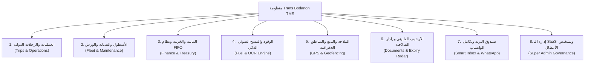
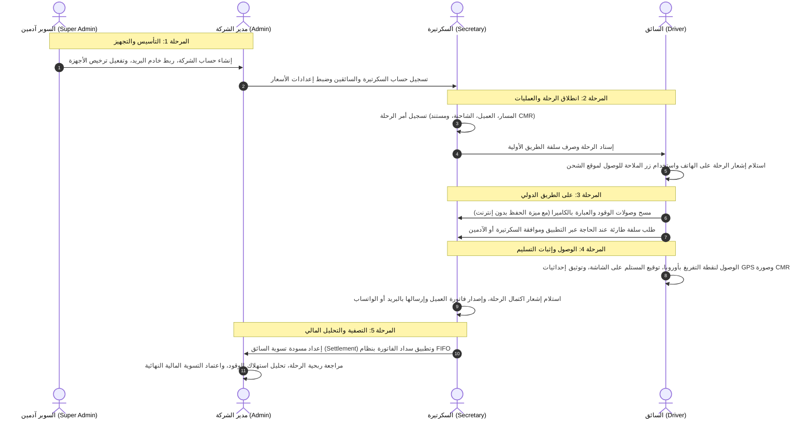

# دليل مكونات المنظومة وصلاحيات الأدوار — Trans Bodanon TMS

> **المرجع التقني والتشغيلي الشامل** لمكونات برنامج إدارة النقل الدولي واللوجستيات (TMS)، وآلية عمل كل دور: **السوبر آدمين (Super Admin)**، **الآدمين (Admin)**، **السكرتيرة (Secretary)**، و**السائق (Driver)**.

---

## فهرس المحتويات
1. [نظرة عامة على معمارية النظام](#1-نظرة-عامة-على-معمارية-النظام)
2. [المكونات والوحدات الوظيفية للنظام](#2-المكونات-والوحدات-الوظيفية-للنظام)
3. [دليل الأدوار والمسؤوليات تفصيلياً](#3-دليل-الأدوار-والمسؤوليات-تفصيلياً)
   - [أولاً: دور السوبر آدمين (Super Admin)](#أولاً-دور-السوبر-آدمين-super-admin)
   - [ثانياً: دور الآدمين / مدير الشركة (Company Admin)](#ثانياً-دور-الآدمين--مدير-الشركة-company-admin)
   - [ثالثاً: دور السكرتيرة (Secretary)](#ثالثاً-دور-السكرتيرة-secretary)
   - [رابعاً: دور السائق (Driver)](#رابعاً-دور-السائق-driver)
4. [مصفوفة الصلاحيات المقارنة (Permissions Matrix)](#4-مصفوفة-الصلاحيات-المقارنة-permissions-matrix)
5. [دورة حياة الرحلة النموذجية وسير العمل المتكامل (End-to-End Workflow)](#5-دورة-حياة-الرحلة-النموذجية-وسير-العمل-المتكامل-end-to-end-workflow)

---

## 1. نظرة عامة على معمارية النظام

يعمل نظام **Trans Bodanon TMS** كمنصة سحابية متقدمة متعددة المستأجرين (**Multi-Tenant SaaS**) مخصصة لشركات النقل البري الدولي للبضائع (TIR) بين المغرب والاتحاد الأوروبي.

```
┌────────────────────────────────────────────────────────────────────────┐
│                   طبقة الإشراف العام (Super Admin SaaS)                 │
│         إدارة الشركات، الاشتراكات، خوادم البريد، ومراقبة الشاشات        │
└───────────────────────────────────┬────────────────────────────────────┘
                                    │
         ┌──────────────────────────┴──────────────────────────┐
         ▼                                                     ▼
┌─────────────────────────────────┐   ┌──────────────────────────────────┐
│        شركة النقل أ (Tenant A)   │   │         شركة النقل ب (Tenant B)   │
│ ┌──────────────┬──────────────┐ │   │ ┌──────────────┬───────────────┐ │
│ │ مدير الشركة  │  السكرتارية  │ │   │ │ مدير الشركة  │   السكرتارية  │ │
│ ├──────────────┴──────────────┤ │   │ ├──────────────┴───────────────┤ │
│ │      أسطول السائقين         │ │   │ │       أسطول السائقين         │ │
│ └─────────────────────────────┘ │   │ └──────────────────────────────┘ │
└─────────────────────────────────┘   └──────────────────────────────────┘
```

### المبادئ الهندسية الصارمة للمنظومة:
1. **عزل البيانات وحصانة الشركات (Tenant Isolation & Security)**:
   - عزل كامل لبيانات كل شركة باستخدام سياسات الأمان على مستوى الصفوف في قاعدة البيانات (**Row Level Security - RLS**).
   - لا يمكن لأي شركة الاطلاع على بيانات الشاحنات أو الرحلات أو المعاملات المالية لشركة أخرى.
2. **المحرك المالي فائق الدقة (Strict Decimal.js Rule)**:
   - يمنع النظام منعاً باتاً استخدام الحسابات التقليدية في الجافاسكريبت (`number`) للعمليات المالية.
   - كافة حسابات الفواتير، أسعار الشحن، استهلاك الوقود، سلف السائقين، وفروق صرف العملات تتم عبر مكتبة `decimal.js` بدقة 20 خانة لضمان الدقة المحاسبية المطلقة.
3. **دعم العمل الميداني دون إنترنت (Offline-First PWA)**:
   - يستطيع السائقون على الطرق الدولية استخدام التطبيق وتسجيل إيصالات الوقود والمهام حتى في المناطق المنعدمة التغطية عبر قوائم الحفظ المؤقتة (`IndexedDB`) مع المزامنة التلقائية عند عودة الاتصال.
4. **التكامل الجغرافي والملاحة الذكية (GPS & Routing Engine)**:
   - ربط إحداثيات الشحن والتفريغ بنظام توجيه فوري يفتح المسارات مباشرة على تطبيقات الخرائط العالمية (**Google Maps, Waze, Apple Maps**).

---

## 2. المكونات والوحدات الوظيفية للنظام



### 1. إدارة أوامر الرحلات الدولية (Trips & Operations)
- **أوامر الشحن ثنائية الاتجاه**: إدارة تفاصيل رحلات الذهاب التصديرية (**Export**) ورحلات العودة الاستيرادية (**Import**).
- **الوثائق الجمركية واللوجستية المرفقة**: ربط وثيقة الشحن الدولية (**CMR**)، شهادات الصحة النباتية (**Phyto**)، والبيانات الجمركية الدولية (**MRN**).
- **إدارة تذاكر العبّارات (Ferry Expenses)**: تسجيل شركات الملاحة البحرية، رموز الحجز السريعة (*Localizador*)، وتكاليف العبور البحري.
- **مخططات المسارات (Transport Routes)**: احتساب المسافات البرية والبحرية، وتكاليف الكيلومتر، وتكاليف الجمارك والترانزيت في الموانئ (طنجة المتوسط، الجزيرة الخضراء، موتريل).

### 2. إدارة الأسطول والمركبات (Fleet & Assets)
- **بطاقات الشاحنات والمقطورات**: تسجيل لوحات الترقيم المغربية والأوروبية، سنة الصنع، القوة الحصانية، والحمولة.
- **معدل استهلاك الوقود المعياري**: ضبط نسبة الاستهلاك القياسية لكل شاحنة (المعيار 36 لتر/100 كم) لقياس كفاءة استهلاك السائقين.
- **سجلات الصيانة وورش الإصلاح**: متابعة الفحص التقني الدوري، فواتير ورش الإصلاح، وقطع الغيار المشتراة.

### 3. المالية، الخزينة، ونظام الفواتير (Finance & Treasury)
- **تخصيص المدفوعات بنظام FIFO**: توزيع دفعات العملاء آلياً على أقدم الفواتير المستحقة، مع دعم الفواتير بضريبة القيمة المضافة (TVA) وبدونها.
- **إدارة الخزينة متعددة العملات**: حسابات بنكية وصناديق نقدية بالدرهم المغربي (MAD) واليورو (EUR).
- **فروق أسعار الصرف (Forex Realized Gain/Loss)**: احتساب الأرباح أو الخسائر المحققة الناتجة عن تذبذب سعر صرف اليورو بين تاريخ الفاتورة وتاريخ التحصيل.
- **التسويات الختامية للسائقين (Driver Settlements)**: تصفية حسابات رحلة السائق بمقارنة سلف الطريق مع المصاريف والمكافآت والغرامات.

### 4. وحدة الوقود والمسح الضوئي (Fuel & OCR)
- **المسح التلقائي بالذكاء الاصطناعي**: قراءة بيانات وصولات الوقود من كاميرا الهاتف (اسم المحطة، الكمية باللتر، المبلغ، والعملة).
- **تحليلات الوقود (Fuel Analytics)**: كشف الهدر والانحرافات عن المعدل المعياري ومقارنة أداء الشاحنات.

### 5. التتبع الجغرافي والملاحة الذكية (GPS & Geofencing)
- **مراقبة الشاحنات**: خريطة حية تعرض مواقع الشاحنات وسرعاتها وتاريخ مسارها.
- **المناطق الجغرافية المحمية (Geofence Zones)**: رسم حواجز افتراضية للموانئ والمستودعات الجمركية مع إطلاق تنبيهات عند الدخول والخروج.
- **التوجيه بنقرة زر (Navigation Launcher)**: فتح مواقع الشحن والتفريغ مباشرة في Google Maps أو Waze أو Apple Maps.

### 6. رادار الوثائق القانونية وتواريخ الصلاحية (Compliance Radar)
- **أرشفة الوثائق**: بطاقات التأمين، الفحص التقني، بطاقات الرميد، ورخص السياقة وتأشيرات شنغن.
- **الإنذار المبكر**: تنبيهات ملونة (آمن / تحذير / منتهي) قبل انتهاء صلاحية أي وثيقة بفترة كافية لمنع توقف الشاحنات.

### 7. البريد الإلكتروني الذكي والواتساب (Communication Hub)
- **صندوق البريد المستقل**: بيئة بريدية كاملة مرتبطة بنطاق الشركة تستقبل مراسلات العملاء والموردين وتتيح ربط المرفقات بالرحلات بنقرة واحدة.
- **تنبيهات وتذكيرات WhatsApp**: قوالب فورية لإرسال إشعارات للعملاء بمواقع الشحنات ومواعيد الفواتير ومراسلة السائقين.

---

## 3. دليل الأدوار والمسؤوليات تفصيلياً

---

### أولاً: دور السوبر آدمين (Super Admin)

> **المسمى**: المشرف العام لمنظومة الـ SaaS  
> **نطاق الصلاحيات**: السيطرة التقنية المركزية على المنظومة والشركات دون التدخل في العمليات اليومية لبيانات الشركات الداخلية.

#### الشاشات والمسارات الحصرية:
- `/super-admin/companies`: إدارة الشركات والاشتراكات.
- `/super-admin/screen-issues`: مركز تتبع مشاكل الشاشات وإدخال البيانات.

#### المهام والمسؤوليات الرئيسية:
1. **إدارة الشركات والاشتراكات (Tenant Management)**:
   - إنشاء شركات نقل جديدة، وتسجيل الاسم التجاري، رقم التعريف الضريبي (ICE)، والعملة الأساسية.
   - تحديد تكلفة الاشتراك الشهري أو السنوي، تواريخ البداية والنهاية، وتجميد أو تنشيط الشركات.
   - تحديد الحد الأقصى للأجهزة المتزامنة المسموح بها لكل شركة (`max_devices`).
2. **التهيئة التلقائية لخوادم البريد المستقلة (Dynamic Mail Provisioning)**:
   - تخصيص نطاق البريد الخاص بكل شركة (مثل `@transbodanon.com`).
   - إعداد خوادم الإرسال والاستقبال (SMTP & IMAP) تلقائياً (cPanel / Hostinger / OVH / خادم مخصص)، وتوثيق الاتصال الأمني لضمان استقلالية مراسلات كل شركة.
3. **حوكمة وتراخيص الأجهزة (`company_devices`)**:
   - متابعة الأجهزة المصرح لها بالدخول (حاسوب، هاتف، تابلت)، معرف الجهاز (Device ID)، رقم الرخصة، عنوان الـ IP، وتاريخ آخر استخدام، مع إمكانية إلغاء ترخيص أي جهاز غير مصرح به.
4. **مركز تتبع مشاكل الشاشات وتشخيص الأعطال بالذكاء الاصطناعي (Gemini AI Diagnostics)**:
   - شاشة مراقبة مركزية ترصد فوراً أي خطأ أو عطل يواجه المستخدمين في أي شاشة (أخطاء تحقق Zod، فشل تقديم النماذج، أخطاء القيود في قاعدة البيانات).
   - تشخيص فوري وتحليل للأعطال البرمجية مدعوم بالذكاء الاصطناعي مع اقتراح حلول تصحيحية للمطور لضمان استقرار النظام.

---

### ثانياً: دور الآدمين / مدير الشركة (Company Admin)

> **المسمى**: المدير العام / المسؤول المالي والتنفيذي للشركة  
> **نطاق الصلاحيات**: السيطرة الإدارية والمالية الكاملة على جميع أصول ورحلات وحسابات وموظفي شركته فقط.

#### الشاشات والمسارات الحصرية:
- `/dashboard`: لوحة التحكم الإحصائية الشاملة.
- `/executive-dashboard`: لوحة القيادة التنفيذية للإدارة العليا.
- `/trip-profitability`: تحليل ربحية الرحلات وهامش الربح الصافي.
- `/bank-reconciliation`: المطابقة البنكية وتدقيق كشوف الحسابات.
- `/fuel-analytics`: تحليلات واستهلاك الوقود وكشف الهدر.
- `/reports` & `/advanced-reports`: التقارير المالية والتشغيلية المتقدمة.
- `/settings`: إعدادات الشركة، نسبة أرباح المالك، والحساب البنكي الافتراضي.
- `/users`: إدارة موظفي الشركة وصلاحياتهم وتفعيل/تعطيل الحسابات.
- `/audit-logs`: سجل التدقيق الأمني لمراقبة كافة العمليات الحساسة.

#### المهام والمسؤوليات الرئيسية:
1. **الرقابة الاستراتيجية والربحية**:
   - الاطلاع على المؤشرات الكلية: إجمالي الإيرادات بالدرهم واليورو، عدد الرحلات المكتملة، وحالة الأسطول.
   - مراجعة ربحية كل رحلة على حدة بمقارنة سعر الشحن الصافي بجميع تكاليفها (الوقود، العبارات، الترانزيت، الغرامات، وسلف السائقين).
2. **الإدارة المالية المتقدمة والخزينة**:
   - تدقيق ومطابقة كشوف الحسابات البنكية مع قيود الخزينة المسجلة في النظام.
   - مراقبة أرصدة الصناديق النقدية والحسابات البنكية بالعملتين (MAD و EUR).
   - اعتماد التسويات الختامية لحسابات السائقين بعد انتهاء الرحلات.
3. **حوكمة الموارد البشرية والأمان**:
   - تعيين أدوار الموظفين (سكرتيرة، سائق، مدير)، وتعيين الرواتب ونسب المكافآت.
   - مراجعة سجل التدقيق الأمني للتحقق من أي عملية تعديل أو حذف تمت في النظام، مدعمة برقم المعرف، عنوان الـ IP، والتاريخ والوقت.

---

### ثالثاً: دور السكرتيرة (Secretary)

> **المسمى**: منسقة العمليات اللوجستية والمكتب اليومي  
> **نطاق الصلاحيات**: إدخال البيانات اليومية، متابعة الشاحنات، استلام الوثائق، وتسيير صندوق النقدية للمكتب.

#### الشاشات والمسارات المخصصة (بوابة العمليات اليومية):
- `/dashboard`: تفتح تلقائياً على **لوحة مهام السكرتارية والعمليات اليومية** (`SecretaryDashboard`).
- مكونات لوحة السكرتارية:
  - `QuickDataEntryBar`: شريط الإدخال السريع للبيانات.
  - `SecretaryCashCard`: صندوق النقدية والمصروفات النثرية اليومية للمكتب.
  - `CriticalDatesTracker`: رادار المواعيد الحرجة وتواريخ الصلاحية.
  - `TripStagesPipeline`: خط أنابيب مراحل تتبع الرحلات اللوجستية.
  - `SecretaryEmailInbox`: صندوق البريد الإلكتروني الذكي المستقل.

#### المهام والمسؤوليات الرئيسية:
1. **شريط الإدخال السريع (Quick Data Entry)**:
   - فتح أوامر الرحلات الجديدة، تسجيل فواتير صيانة طارئة، إدخال سندات الوقود، وصرف السلف النقدية بخطوات فورية مختصرة.
2. **إدارة صندوق المصروفات النثرية للمكتب (Secretary Petty Cash)**:
   - تسجيل المصروفات اليومية الصغيرة (رسوم جمركية، طوابع، مستلزمات مكتبية) مع خصمها التلقائي والمباشر من صندوق النقدية المخصص.
3. **رادار المواعيد الحرجة والإنذار المبكر (Critical Dates Radar)**:
   - المراقبة اليومية لتواريخ صلاحية وثائق الأسطول (التأمين، الفحص التقني، بطاقات الرميد) ووثائق السائقين (رخص القيادة وتأشيرات شنغن) لتفادي أي غرامات أو توقف للشاحنات في المعابر.
4. **متابعة خط أنابيب مراحل الرحلات (Trip Stages Pipeline)**:
   - متابعة تقدم الرحلات الدولية خطوة بخطوة من الشحن إلى التفريغ:
     - قيد الانتظار $\rightarrow$ تم التحميل $\rightarrow$ في الطريق إلى الميناء $\rightarrow$ عبور الباخرة $\rightarrow$ جمارك الترانزيت $\rightarrow$ تم التسليم في أوروبا $\rightarrow$ رحلة العودة.
5. **صندوق البريد الذكي وإدارة المرفقات (Smart Inbox)**:
   - استلام رسائل العملاء والموردين الجمركيين وشركات العبارات، وربط الوثائق المرفقة (CMR, MRN, Factures) بملف الرحلة أو الشاحنة المناسبة بضغطة زر.
6. **إصدار الفواتير والتواصل مع العملاء**:
   - تجهيز فواتير الشحن بعد إتمام التسليم، ومتابعة التحصيل.
   - إرسال إشعارات وتحديثات الشحن وتذكيرات الفواتير للعملاء عبر قوالب WhatsApp المعتمدة.

---

### رابعاً: دور السائق (Driver)

> **المسمى**: كابتن الشاحنة والمنفذ الميداني على الخطوط الدولية  
> **نطاق الصلاحيات**: واجهة هاتف نقال خفيفة وسريعة تلبي احتياجات السائق أثناء القيادة وعند الوصول.

#### الشاشات والمسارات المخصصة:
- `/driver-tasks`: مهام السائق وجدول الرحلات المسندة.
- `/driver-delivery`: شاشة إثبات التسليم الرقمي (Proof of Delivery - POD).
- `/driver-advances` & `/emergency-advance-requests`: سلف السائق وطلبات الطوارئ.
- `/fuel-receipt`: مسح وصولات الوقود والصيانة بالكاميرا.
- `/chat`: المحادثات الفورية المباشرة مع المكتب.

#### المهام والمسؤوليات الرئيسية:
1. **جدول المهام والتوجيه الملاحي بنقرة واحدة (One-Click GPS)**:
   - استعراض تفاصيل الرحلة: المسار، العميل، التواريخ، ورقم الـ CMR.
   - الضغط على زر التوجيه لموقع الشحن أو موقع التفريغ ليفتح مباشرة في تطبيق الملاحة المفضل (**Google Maps / Waze / Apple Maps**) دون الحاجة لإدخال الإحداثيات يدوياً.
2. **إثبات التسليم الرقمي (Proof of Delivery - POD)**:
   - **التوقيع الإلكتروني الحي (Digital Signature)**: توقيع مستلم البضاعة بإصبعه مباشرة على شاشة الهاتف.
   - **التوثيق الجغرافي الحي (Live GPS Capture)**: تسجيل إحداثيات موقع وتوقيت التسليم بدقة لقطع أي نزاع قانوني.
   - **تصوير وثيقة الـ CMR**: تصوير وثيقة الشحن الموقعة بالكاميرا مع ضغط الصورة تلقائياً لتوفير باقة الهاتف وسرعة الرفع.
3. **مسح إيصالات الوقود والصيانة (مع العمل بدون إنترنت)**:
   - التقاط صورة الوصل بالكاميرا، ليقوم النظام آلياً باستخراج اللترات والمبلغ واسم المحطة عبر الذكاء الاصطناعي (OCR).
   - حفظ الإيصالات محلياً في حال عدم وجود شبكة إنترنت على الطريق، ومزامنتها تلقائياً فور توفر الاتصال.
4. **طلبات السلف الطارئة (Emergency Advances)**:
   - إرسال طلب سلفة عاجلة من الهاتف عند حدوث طارئ في الطريق (عطل مفاجئ، مصاريف عبور غير متوقعة) مع تحديد المبلغ والعملة (MAD أو EUR) والسبب، لتصل إشعاراً فورياً للمكتب.

---

## 4. مصفوفة الصلاحيات المقارنة (Permissions Matrix)

| الوظيفة / الشاشة | السوبر آدمين<br/>(Super Admin) | الآدمين<br/>(Company Admin) | السكرتيرة<br/>(Secretary) | السائق<br/>(Driver) |
| :--- | :---: | :---: | :---: | :---: |
| **إدارة الشركات والاشتراكات** | ✅ **كامل** | ❌ ممنوع | ❌ ممنوع | ❌ ممنوع |
| **ضبط خوادم البريد التلقائية (SMTP/IMAP)** | ✅ **كامل** | ❌ ممنوع | ❌ ممنوع | ❌ ممنوع |
| **مراقبة أعطال الشاشات وتشخيص الذكاء الاصطناعي** | ✅ **كامل** | ❌ ممنوع | ❌ ممنوع | ❌ ممنوع |
| **ترخيص وحظر أجهزة الشركات المتزامنة** | ✅ **كامل** | ❌ ممنوع | ❌ ممنوع | ❌ ممنوع |
| **لوحة القيادة التنفيذية والإحصائيات الكبرى** | ❌ معزول | ✅ **كامل** | ❌ ممنوع | ❌ ممنوع |
| **تحليل ربحية الرحلات (Profitability)** | ❌ معزول | ✅ **كامل** | ❌ ممنوع | ❌ ممنوع |
| **المطابقة البنكية وفروق الصرف (Forex)** | ❌ معزول | ✅ **كامل** | 👁️ عرض الصرف | ❌ ممنوع |
| **تحليلات استهلاك الوقود المتقدمة** | ❌ معزول | ✅ **كامل** | ❌ ممنوع | ❌ ممنوع |
| **إعدادات الشركة وتوزيع أرباح المالك** | ❌ معزول | ✅ **كامل** | ❌ ممنوع | ❌ ممنوع |
| **سجل التدقيق الأمني للعمليات (Audit Logs)** | ❌ معزول | ✅ **كامل** | ❌ ممنوع | ❌ ممنوع |
| **لوحة العمليات اليومية ورادار تواريخ الصلاحية** | ❌ معزول | ✅ متاح | ✅ **اللوحة الأساسية** | ❌ ممنوع |
| **شريط الإدخال السريع وصندوق المصروفات النثرية** | ❌ معزول | ✅ متاح | ✅ **صلاحية أساسية** | ❌ ممنوع |
| **إدارة الرحلات والأسطول والوثائق** | ❌ معزول | ✅ تعديل وحذف | ✅ إنشاء وتعديل | ❌ ممنوع |
| **صندوق البريد الإلكتروني الذكي للشركة** | ❌ معزول | ✅ متاح | ✅ **استخدام يومي** | ❌ ممنوع |
| **تتبع الشاحنات والمناطق المحمية Geofence** | ❌ معزول | ✅ **كامل** | ✅ متابعة حية | ❌ ممنوع |
| **إنشاء الفواتير وتخصيص السداد (FIFO)** | ❌ معزول | ✅ اعتماد كامل | ✅ إدخال ومتابعة | ❌ ممنوع |
| **إرسال تنبيهات وتذكيرات WhatsApp** | ❌ معزول | ✅ متاح | ✅ **استخدام يومي** | ❌ ممنوع |
| **عرض الرحلات والمهام المسندة** | ❌ معزول | 👁️ عرض الكل | 👁️ عرض الكل | ✅ **رحلاته فقط** |
| **التوجيه الملاحي بنقرة زر (GPS Navigation)** | ❌ معزول | 👁️ متاح | 👁️ متاح | ✅ **استخدام أساسي** |
| **إثبات التسليم الرقمي والتوقيع الحي (POD)** | ❌ معزول | 👁️ مراجعة واعتماد | 👁️ مراجعة واعتماد | ✅ **تنفيذ وتوقيع** |
| **مسح إيصالات الوقود بالكاميرا (مع Offline)** | ❌ معزول | ✅ متاح | ✅ متاح | ✅ **تنفيذ بالكاميرا** |
| **طلب سلفة طارئة من الطريق** | ❌ معزول | ⚖️ موافقة واعتماد | ⚖️ مراجعة وصرف | ✅ **إنشاء طلب** |

---

## 5. دورة حياة الرحلة النموذجية وسير العمل المتكامل (End-to-End Workflow)



---

> **ملاحظة إدارية**: تم تحديث هذا الدليل ليعكس أحدث التعديلات والترقيات المعمارية المطبقة في منظومة **Trans Bodanon TMS** لعام 2026.

